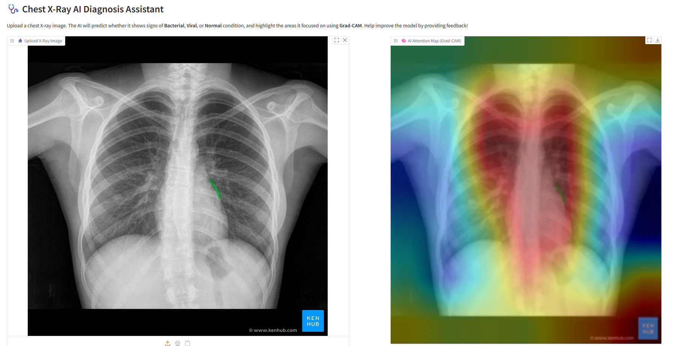

# Pneumonia Detection: Viral vs Bacterial

A deep learning project that classifies chest X-ray images into **Normal**, **Bacterial Pneumonia**, or **Viral Pneumonia**, complete with visual explanations and an interactive feedback system to improve future predictions.

---

## 🚀 Features

- **Accurate Pneumonia Classification**  
  Distinguishes between bacterial pneumonia, viral pneumonia, and normal chest X-rays using a DenseNet121-based deep learning model.

- **Explainability via Grad-CAM**  
  Generates heatmaps highlighting regions in the X-ray that influenced the model's prediction, enabling clinicians to interpret model decisions visually.

- **Feedback Collection System**  
  Allows healthcare professionals to confirm or correct predictions and save images with labels to continuously improve the dataset and model.

- **User-Friendly Gradio Interface**  
  Provides an intuitive web app for uploading chest X-rays, displaying predictions, confidence scores, and Grad-CAM overlays interactively.

---

## 🫁 What is Pneumonia?

Pneumonia is an infection that inflames the lung’s air sacs (alveoli), potentially caused by bacteria, viruses, or other agents. Common symptoms include:

- Cough (dry or productive)  
- Fever  
- Chest pain  
- Difficulty breathing  

High-risk groups include individuals with COPD, asthma, diabetes, heart conditions, or compromised immune systems.

Diagnosis is typically done through:

- Physical examination  
- Chest X-ray imaging  
- Blood or sputum tests

---

## 📁 Datasets Used

This project combines two publicly available datasets to build a robust and balanced training set:

1. [Chest X-Ray Pneumonia - Paul Timothy Mooney (Kaggle)](https://www.kaggle.com/paultimothymooney/chest-xray-pneumonia)  
2. [Pneumonia Dataset - nkifor (Kaggle)](https://www.kaggle.com/datasets/nkifor/pneumonia-dataset)  

To ensure dataset quality and avoid duplicates, image **hashing** was applied, preventing data leakage and redundancy.

---

## ⚙️ How to Use

1. Upload a chest X-ray image via the Gradio interface.  
2. View the model's predicted class and confidence score.  
3. Examine the Grad-CAM heatmap highlighting key areas of attention.  
4. Provide feedback by confirming or correcting the prediction, helping to expand and improve the training data.

---

## 📸 Demo

Here is a sample output from the Gradio interface showing the AI prediction and Grad-CAM attention overlay on a chest X-ray:

---

## 📌 Notes

- The trained model weights are **not** included in this repository due to file size restrictions.  
- Grad-CAM heatmaps use the last convolutional layer of DenseNet121 to provide meaningful visual explanations.  
- The dataset preparation script carefully balances the data across classes and splits to improve model performance.

---

## 🙌 Contributions & Feedback

Contributions and feedback are welcome to improve this tool for clinical and research use.
